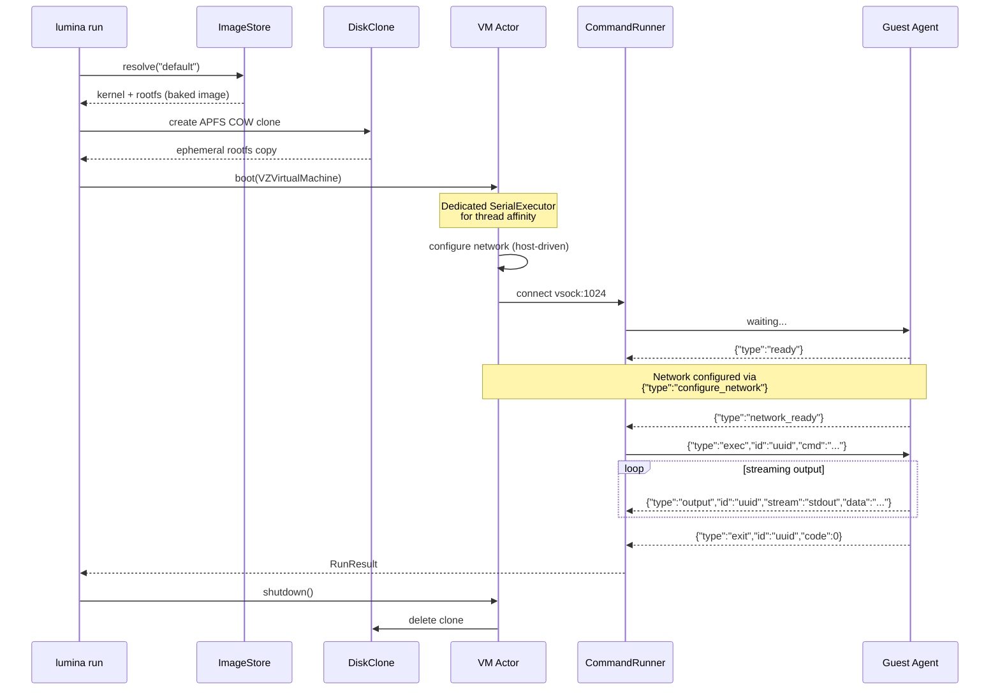
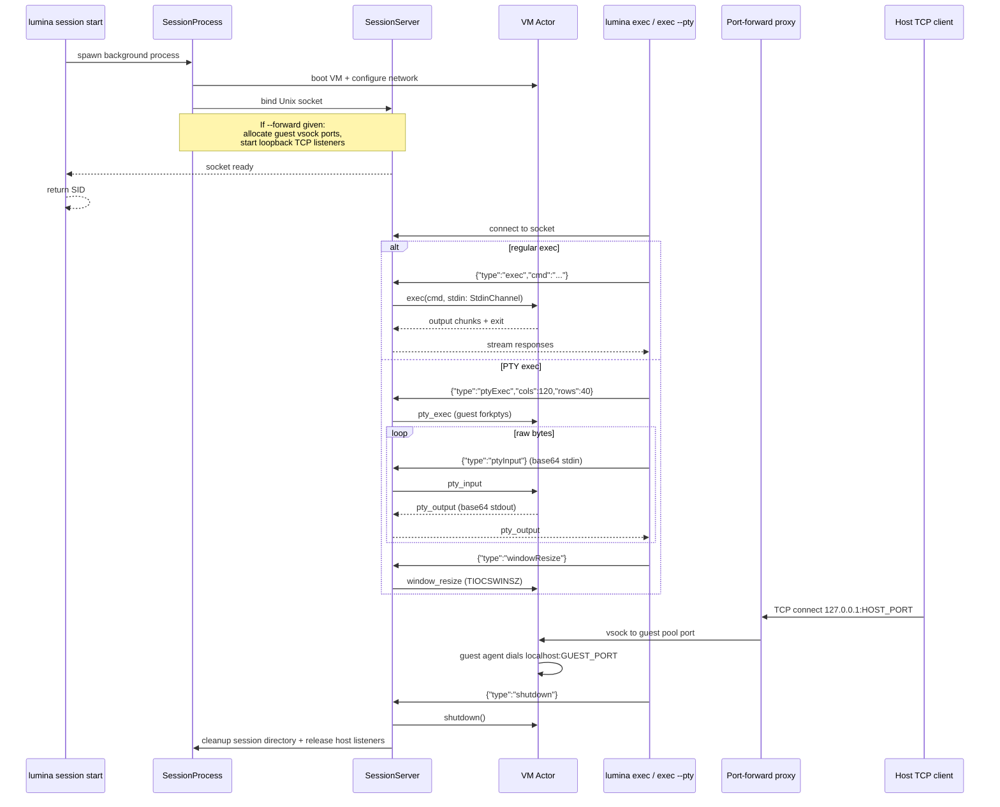
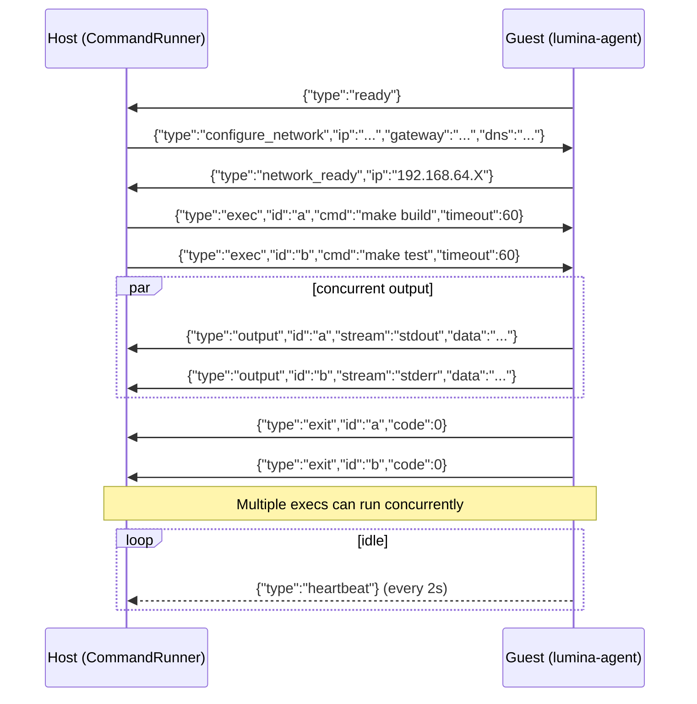

<div align="center">

# Lumina

**Native Apple Workload Runtime for Agents**

`subprocess.run()` for virtual machines — with interactive PTYs, port forwarding, and live observability.

[](https://github.com/abdul-abdi/lumina/actions/workflows/ci.yml)
[](https://swift.org)
[](https://developer.apple.com/macos/)
[](https://support.apple.com/en-us/116943)
[](LICENSE)

Boot a Linux VM, run a command, get the output.<br>
One function call. ~1.6s cold start (~300ms with custom kernel). ~30ms warm exec. Zero host access.


</div>

---

## Get Started

> **Requires:** macOS 14+ (Sonoma) &middot; Apple Silicon (M1/M2/M3/M4)

```bash
make install                        # build + install to ~/.local/bin
lumina run "echo hello world"       # image auto-pulls on first run
```

> If `~/.local/bin` isn't on your PATH: `export PATH="$HOME/.local/bin:$PATH"`
>
> For a system-wide install: `sudo make install PREFIX=/usr/local`

**New in v0.6.0:** interactive PTY via `lumina exec --pty`, host-to-guest TCP port forwarding via `lumina session start --forward`, live session inventory via `lumina ps`, and a **unified JSON envelope** for `lumina run` / `lumina exec` output. See [AGENT.md](AGENT.md) for the agent-facing API surface.

## Why Lumina?

AI agents need to run untrusted code. The question is where.

| | Lumina | Docker | SSH to cloud VM |
|---|--------|--------|-----------------|
| **Cold start** | ~390ms P50 (M3 Pro) | ~3-5s | 30-60s |
| **Exec after boot** | ~31ms P50 · 1ms stdev | ~50-100ms | ~20-50ms (RTT) |
| **Isolation** | Hardware (Virtualization.framework) | Kernel namespaces (shared kernel) | Full VM |
| **Host exposure** | None — no mounted filesystem, no Docker socket | Container escape risk, daemon access | Network-exposed |
| **Cleanup** | Automatic — COW clone deleted on exit | Manual — images/volumes linger | Manual — VM persists |
| **Dependencies** | Zero — ships as one binary | Docker daemon | Cloud account + SSH keys |
| **macOS native** | Yes — `VZVirtualMachine` | Linux-first (Docker Desktop is a VM) | N/A |
| **Agent-friendly** | Unified JSON envelope when piped, text on TTY — zero config | Text only (needs parsing) | Text only |
| **Interactive REPL / TUI** | `lumina exec --pty` | `docker exec -it` | `ssh -t` |
| **Host-to-guest TCP** | `--forward 3000:3000` | `-p 3000:3000` | SSH tunnel |
| **Persistent sessions** | Built-in | N/A | SSH sessions |

Boot time is paid once. Exec latency is paid every iteration. Lumina sessions give you both: hardware-isolated VMs with subprocess-fast execution. No daemon, no container registry, no cloud credentials.

## Performance

Benchmarked on M3 Pro, macOS 26.4, release build with the default baked image (Apple's stripped 6.18.5 kernel, agent baked into rootfs).

| Workload | Lumina P50 | Lumina P95 | Apple `container` P50 | Apple P95 |
|---|---|---|---|---|
| Cold boot `true` | **390ms** | 470ms | 844ms | 1687ms |
| Cold boot `echo hello` | **403ms** | 450ms | 783ms | 1598ms |
| Warm session exec `true` | **31ms** (1ms stdev) | 33ms | 84ms (10ms stdev) | 111ms |
| Daemon idle memory | **0 MB** | — | ~54 MB | — |
| Sustained session exec rate | **100/s** | — | — | — |

Lumina's zero-daemon in-process model is 2–3× faster across every workload and 10× more consistent on warm exec. File transfer sustains 75 MB/s upload / 35 MB/s download. Stdout streaming delivers 33 MB/s to the host at bit-perfect fidelity up to 10M+ lines. The stress suite validates 8 concurrent VMs on an 18GB M3 Pro, 100K-line stdout round-trip in ~1s, and a 3-minute sustained session running 171 periodic execs without degradation.

## Scaling

macOS's Virtualization framework memory-bounds concurrent VMs to roughly 2/3 of host RAM. On an 18GB M3 Pro, 10 concurrent 512MB VMs boot cleanly; 8 concurrent 1GB VMs (the `lumina run` default) is the validated ceiling. Beyond the RAM threshold, new boots fail fast with `bootFailed` — a hypervisor-level rejection, not OOM.

For higher throughput:

1. **Session (best for repeated commands on the same filesystem state)** — boot once, exec many. Warm exec is ~31ms P50 with 1ms stdev.
   ```bash
   SID=$(lumina session start)
   lumina exec $SID "command1"
   lumina exec $SID "command2"
   lumina session stop $SID
   ```

2. **Pool** — pre-warm N VMs, run commands across them at zero cold-boot cost. Concurrent, results streamed as NDJSON.
   ```bash
   lumina pool run --size 4 --count 20 "python3 -c 'import random; print(random.random())'"
   # Boots 4 VMs once, runs the command 20 times, 4 concurrent
   ```

3. **Parallel `lumina run`** — works up to the host RAM ceiling. Beyond that, use a session or pool.

4. **Library-level semaphore** — if you're calling `Lumina.run()` directly from Swift, wrap it in a `DispatchSemaphore` or `AsyncSemaphore` sized to stay under the host's VM ceiling.

## Usage

### One-shot (Disposable VMs)

```bash
# Run a command — streams output on terminal, returns a single JSON envelope when piped
lumina run "echo hello"
lumina run "make build"

# Pipe and parse — unified envelope: { stdout, stderr, exit_code, duration_ms }
lumina run "uname -a" | jq -r .stdout

# Environment variables
lumina run -e API_KEY=sk-123 -e DEBUG=1 "env | grep API"

# File transfers — auto-detects file vs directory
lumina run --copy ./data.csv:/tmp/data.csv "python3 process.py"
lumina run --copy ./project:/code --workdir /code "make build"
lumina run --download /tmp/results.json:./results.json "generate-report"

# Named volumes — data persists across runs
lumina run --volume mydata:/data "echo hello > /data/file.txt"
lumina run --volume mydata:/data "cat /data/file.txt"   # still there

# Host directory mount
lumina run --volume ./src:/mnt/src "cat /mnt/src/README.md"
```

`lumina run` has 7 flags. Everything else (memory, CPUs, streaming, output format) is auto-detected or configurable via environment variables. See [Environment Variables](#environment-variables).

### Sessions (Persistent VMs)

Boot once, exec many. Pay ~300ms boot once, then run commands at ~30ms each.

```bash
# Start a session — configure resources + forwarded ports at creation time
SID=$(lumina session start)
SID=$(lumina session start --memory 4GB --cpus 4 --disk-size 8GB)
SID=$(lumina session start --forward 3000:3000 --forward 8080:80)

# Execute commands — ~30ms each (VM already running)
lumina exec $SID "apk add python3"
lumina exec $SID "python3 -c 'print(42)'"
lumina exec $SID -e MY_VAR=hello "echo \$MY_VAR"
lumina exec $SID --workdir /tmp "pwd"

# Stdin piping — pipe data into a session exec
echo '{"key": "value"}' | lumina exec $SID "python3 -c 'import sys,json; d=json.load(sys.stdin); print(d)'"
cat large_file.csv | lumina exec $SID "awk -F, '{sum+=$2} END {print sum}'"

# File transfers via lumina cp
lumina cp ./script.py $SID:/tmp/script.py
lumina exec $SID "python3 /tmp/script.py"
lumina cp $SID:/tmp/output.txt ./output.txt

# List and stop
lumina session list
lumina session stop $SID
```

Sessions with volumes — data persists across sessions and disposable runs:

```bash
lumina volume create workspace
SID=$(lumina session start --volume workspace:/data)
lumina exec $SID "echo 'cached result' > /data/output.txt"
lumina session stop $SID

# Data survives — read from a brand new VM
lumina run --volume workspace:/data "cat /data/output.txt"
```

### Interactive Sessions (PTY)

`lumina exec --pty` allocates a pseudo-terminal for the command, so REPLs, TUIs, and anything that probes `isatty(3)` Just Work. CR-overwrite, ANSI colour codes, and window resizes all pass through byte-perfect.

```bash
SID=$(lumina session start)

# Drop into a shell inside the VM
lumina exec --pty $SID "sh"

# REPLs
lumina exec --pty $SID "python3"
lumina exec --pty $SID "node"

# TUIs — `htop`, `vim`, `claude`, anything that draws to the terminal
lumina exec --pty $SID "htop"

lumina session stop $SID
```

**Constraints in v0.6.0:** one active PTY per session (non-PTY `exec` still runs concurrently alongside); `--pty` requires a session (not `lumina run`); stdin must be a real TTY. Ctrl-C and SIGTERM restore your terminal cleanly — signal handling uses `DispatchSourceSignal`, installed before entering raw mode.

See [AGENT.md](AGENT.md) for the wire protocol (`pty_exec` / `pty_input` / `pty_output` / `window_resize`) if you're driving PTY sessions from code.

### Port Forwarding (`--forward`)

Expose a guest TCP port on the host's `127.0.0.1` — for hitting dev servers, databases, or anything listening inside the VM.

```bash
SID=$(lumina session start --forward 3000:3000)
lumina exec $SID "python3 -m http.server 3000" &
curl http://127.0.0.1:3000/

lumina session stop $SID   # host listener is released automatically
```

Multiple forwards per session are supported; the host side always binds to loopback only (never `0.0.0.0`). The guest agent allocates a vsock port from its pool and replies with `port_forward_ready` before the host starts accepting — no race.

### Observability (`lumina ps`)

List live sessions in one command. Agents can pipe this through `jq` to find their own sessions, count in-flight execs, or reap stale ones.

```bash
$ lumina ps | jq .
[
  {
    "sid": "9985A5F9-F630-4C8B-B58C-5EB6A2AC60C7",
    "image": "default",
    "uptime_seconds": 42.6,
    "active_execs": 1
  }
]
```

Sessions that have gone unresponsive still appear with an `error: "unreachable"` field so they're visible for cleanup via `lumina session stop`.

### Custom Images

Pre-install packages so every run starts ready:

```bash
# Create a Python image (~17s to build, then ~300ms to boot forever after)
lumina images create python --from default --run "apk add --no-cache python3"

# Multi-step builds — abort on first failure
lumina images create godev --from default --run "apk add go" --run "apk add git"

# Rosetta for x86_64 binaries — stored in image metadata, auto-detected at boot
lumina images create x86dev --from default --run "apt install gcc" --rosetta

# Use custom images — no install wait
lumina run --image python "python3 -c 'import sys; print(sys.version)'"

# Manage images
lumina images list
lumina images inspect python
lumina images remove python
```

### Volumes

Named persistent storage, mounted via virtio-fs:

```bash
lumina volume create mydata
lumina run --volume mydata:/data "echo hello > /data/file.txt"
lumina run --volume mydata:/data "cat /data/file.txt"   # still there

lumina volume list
lumina volume inspect mydata
lumina volume remove mydata
```

### Networking (Multi-VM)

Run interconnected VMs on a shared private network:

```bash
cat > network.json << 'EOF'
{
  "sessions": [
    {"name": "db", "image": "default"},
    {"name": "api", "image": "default"}
  ]
}
EOF

# Boot all VMs on a shared ethernet switch
lumina network run network.json
# VMs can reach each other by name (db, api) via /etc/hosts
```

---

## Output Contract

Lumina auto-detects output format. Piped: one JSON object. TTY: human-readable text.

**Unified envelope** (piped JSON, default for both `lumina run` and `lumina exec`):

```json
{"stdout": "hello\n", "stderr": "", "exit_code": 0, "duration_ms": 668}
```

**Error envelope** — `error` is set, `exit_code` is absent, and `partial_stdout` / `partial_stderr` are included where the command actually ran:

```json
{"error": "timeout", "duration_ms": 3910, "partial_stdout": "begin\n", "partial_stderr": ""}
```

The four error states are exhaustive and mutually exclusive:

| `error` | Meaning | Partials? |
|---------|---------|-----------|
| `timeout` | Command's `--timeout` fired | yes |
| `vm_crashed` | Guest kernel or agent died mid-exec | yes |
| `session_disconnected` | Session IPC socket dropped mid-exec | yes |
| `connection_failed` | VM/session couldn't be reached at all — command never started | no |

**Legacy NDJSON** streaming (pre-v0.6.0 per-chunk format) is preserved behind `LUMINA_OUTPUT=ndjson` for migration, and removed in v0.8.0.

---

## Environment Variables

Resource configuration, output format, and streaming are controlled via environment variables. Set once, forget forever.

| Variable | Controls | Default | Example |
|----------|----------|---------|---------|
| `LUMINA_MEMORY` | VM memory | `1GB` | `LUMINA_MEMORY=2GB` |
| `LUMINA_CPUS` | CPU cores | `2` | `LUMINA_CPUS=4` |
| `LUMINA_TIMEOUT` | Command timeout | `60s` | `LUMINA_TIMEOUT=300s` |
| `LUMINA_DISK_SIZE` | Rootfs size | image default | `LUMINA_DISK_SIZE=4GB` |
| `LUMINA_FORMAT` | Output format | auto (JSON piped, text TTY) | `LUMINA_FORMAT=text` |
| `LUMINA_STREAM` | Text-mode streaming | auto (stream TTY, buffer piped) | `LUMINA_STREAM=1` |
| `LUMINA_OUTPUT` | Legacy per-chunk NDJSON (removed v0.8.0) | unset = unified envelope | `LUMINA_OUTPUT=ndjson` |

**Priority:** `session start` flags > env var > built-in default.

For `lumina run`, resource settings come from env vars only (no flags). This keeps the common case clean — agents set env vars once in their environment, every `run` command inherits them.

For `lumina session start`, resource flags (`--memory`, `--cpus`, `--disk-size`, `--forward`) override env vars. This lets you provision different sessions with different resources in the same workflow.

---

## Auto-Detection

Lumina auto-detects everything it can so you type less:

| Feature | How it works |
|---------|-------------|
| **Output format** | JSON when piped (for agents), text on TTY (for humans) |
| **Streaming (text)** | Streams on TTY (real-time output), buffers when piped |
| **Output envelope (JSON)** | Single unified envelope when piped; `LUMINA_OUTPUT=ndjson` for legacy per-chunk streaming |
| **`--copy` file/dir** | Stats the local path — routes to file upload or directory tar+upload |
| **`--download` file/dir** | Execs `test -d` on the guest — routes to file download or directory tar+download |
| **`--volume` mount/volume** | Path prefix (`/` or `.`) = host directory mount, otherwise = named volume lookup |
| **Rosetta** | Read from image metadata at boot. Set via `images create --rosetta`. |
| **Network** | Always configured. No flags needed. |
| **Image pull** | Auto-pulls default image on first run if not present. |
| **Session ID parsing** | `exec` and `session stop` accept `{"sid":"UUID"}` JSON or bare UUID — pipe `session start` output directly without `jq`. |

---

<details>
<summary><strong>Full CLI Reference</strong></summary>

### `lumina run` (7 flags)

```bash
lumina run <command>                          # run, stream on TTY, unified JSON when piped
lumina run --image python <command>           # use a custom image
lumina run --timeout 5m <command>             # command timeout (default: 60s)
lumina run -e KEY=VAL <command>               # env vars (repeatable)
lumina run --copy local:remote <command>      # upload file or directory before exec
lumina run --download remote:local <command>  # download file or directory after exec
lumina run --volume path_or_name:guest <cmd>  # mount host dir or named volume
lumina run --workdir /code <command>          # working directory inside VM
```

### `lumina exec` (4 flags)

```bash
lumina exec <sid> <command>                   # unified JSON when piped, streams on TTY
lumina exec <sid> --pty <command>             # allocate a PTY (REPLs / TUIs / interactive shells)
lumina exec <sid> --timeout 5m <command>      # timeout
lumina exec <sid> -e KEY=VAL <command>        # env vars (repeatable)
lumina exec <sid> --workdir /code <command>   # working directory
```

### `lumina cp` (0 flags)

```bash
lumina cp ./local.txt <sid>:/remote.txt       # upload to session
lumina cp <sid>:/remote.txt ./local.txt       # download from session
```

### `lumina session` (6 flags on start)

```bash
lumina session start                          # start with defaults
lumina session start --image python           # custom image
lumina session start --memory 4GB --cpus 4    # configure resources
lumina session start --disk-size 8GB          # larger rootfs
lumina session start --volume data:/mnt       # mount volume at boot
lumina session start --forward 3000:3000      # forward host port to guest (repeatable)
lumina session list                           # list active sessions
lumina session stop <sid>                     # stop session (also releases forwarded ports)
```

### `lumina ps`

```bash
lumina ps                                     # JSON array: sid, image, uptime_seconds, active_execs
```

### `lumina images` (4 flags on create)

```bash
lumina images list                            # list cached images
lumina images create NAME --from BASE --run CMD  # build custom image
lumina images create NAME --run CMD --run CMD2   # multi-step build
lumina images create NAME --run CMD --rosetta    # x86_64 image
lumina images create NAME --timeout 10m --run CMD  # build timeout
lumina images inspect NAME                    # show image details
lumina images remove NAME                     # remove (checks deps)
```

### `lumina volume`

```bash
lumina volume create NAME                     # create named volume
lumina volume list                            # list all volumes
lumina volume inspect NAME                    # show details + size
lumina volume remove NAME                     # delete volume
```

### `lumina pool` (6 flags on run)

```bash
lumina pool run --size 4 "command"            # boot 4 VMs, run once each
lumina pool run --size 4 --count 20 "cmd"     # 4 VMs, 20 total runs (5 per VM)
lumina pool run --size 4 --concurrency 2 "cmd" # 4 VMs, 2 concurrent at a time
lumina pool run --size 4 --image python "cmd" # custom image
lumina pool run --size 4 --memory 2GB "cmd"   # per-VM memory
lumina pool run --size 4 -e KEY=VAL "cmd"     # env vars
```

### `lumina pull` / `lumina clean` / `lumina network`

```bash
lumina pull                                   # download default image
lumina pull --force                           # re-download even if exists
lumina clean                                  # remove orphaned COW clones
lumina network run manifest.json              # boot VMs from manifest
```

</details>

---

### Swift Library

```swift
import Lumina

// One-shot — boot, exec, teardown in one call
let result = try await Lumina.run("cargo test", options: RunOptions(
    timeout: .seconds(120),
    image: "default",
    env: ["CI": "true"]
))
print(result.stdout)               // RunResult { stdout, stderr, exitCode, wallTime }

// Stream output in real time
for try await chunk in Lumina.stream("make build") {
    switch chunk {
    case .stdout(let text): print(text, terminator: "")
    case .stderr(let text): print(text, terminator: "", to: &stderr)
    case .exit(let code):   print("Exit: \(code)")
    }
}
```

<details>
<summary><strong>Advanced: Sessions, Custom Images, Volumes, Networking</strong></summary>

```swift
// File transfers — upload into VM, download results after execution
let result = try await Lumina.run("python3 /tmp/process.py", options: RunOptions(
    uploads: [FileUpload(localPath: inputURL, remotePath: "/tmp/process.py")],
    downloads: [FileDownload(remotePath: "/tmp/out.json", localPath: outputURL)]
))

// Custom image creation — build once, boot fast forever
try await Lumina.createImage(
    name: "python", from: "default", command: "apk add python3"
)

// Rosetta images for x86_64 binaries
try await Lumina.createImage(
    name: "x86dev", from: "default", command: "apt install gcc", rosetta: true
)

// Lifecycle API — explicit control, multi-command sessions
let vm = VM(options: VMOptions(cpuCount: 4))
try await vm.boot()
try await vm.uploadFiles([FileUpload(localPath: scriptURL, remotePath: "/tmp/run.sh")])
let r1 = try await vm.exec("chmod +x /tmp/run.sh && /tmp/run.sh")
let r2 = try await vm.exec("cat /tmp/results.json")
await vm.shutdown()

// Private networking — VM-to-VM communication
try await Lumina.withNetwork("mynet") { network in
    let db  = try await network.session(name: "db",  image: "default")
    let api = try await network.session(name: "api", image: "default")
    let result = try await api.exec("ping -c1 db")
}
```

</details>

---

## How It Works



<details>
<summary><strong>Session Architecture (incl. PTY + port forwarding)</strong></summary>



Sessions use Unix domain sockets at `~/.lumina/sessions/<sid>/control.sock` for IPC. The session server runs as a background process, accepts concurrent connections, and dispatches to the VM actor.

- **Regular `exec`** streams through the concurrent dispatcher — multiple execs share one VM via an ID-keyed map under `execLock`.
- **PTY exec** is a distinct path with its own handler map under `ptyLock`. One active PTY per session (`activePtyId`); regular `exec` still runs alongside.
- **Port forwarding** lifecycle: host sends `port_forward_start { guest_port }`, guest agent replies `port_forward_ready { guest_port, vsock_port }`, then the host opens a loopback TCP listener. `session stop` releases the listener and sends `port_forward_stop`.

</details>

<details>
<summary><strong>Guest Agent Protocol</strong></summary>

Newline-delimited JSON over virtio-socket (port 1024, max 128KB per message). All exec messages carry an `id` field for concurrent command multiplexing.



**File transfers** use the same vsock connection with ACK-based backpressure:

| Direction | Flow |
|-----------|------|
| **Upload** (host -> guest) | `upload` -> `upload_ack` per 48KB chunk -> `upload_done` |
| **Download** (guest -> host) | `download_req` -> `download_data` per 48KB chunk (seq + EOF) |

**Stdin piping:**

| Message | Direction | Purpose |
|---------|-----------|---------|
| `{"type":"stdin","id":"uuid","data":"..."}` | host -> guest | Pipe data to running command |
| `{"type":"stdin_close","id":"uuid"}` | host -> guest | Close stdin pipe (triggers EOF) |

**PTY (v0.6.0, distinct from `exec`):**

| Message | Direction | Purpose |
|---------|-----------|---------|
| `{"type":"pty_exec","id":"uuid","cols":120,"rows":40,...}` | host -> guest | Fork with a new PTY |
| `{"type":"pty_input","id":"uuid","data":"<base64>"}` | host -> guest | Raw bytes into the PTY master |
| `{"type":"window_resize","id":"uuid","cols":120,"rows":40}` | host -> guest | `TIOCSWINSZ` (buffered if PTY not yet allocated) |
| `{"type":"pty_output","id":"uuid","data":"<base64>"}` | guest -> host | 4KB chunked reads from master (merged stdout+stderr) |

**Port forwarding (v0.6.0):**

| Message | Direction | Purpose |
|---------|-----------|---------|
| `{"type":"port_forward_start","guest_port":3000}` | host -> guest | Request forwarding |
| `{"type":"port_forward_ready","guest_port":3000,"vsock_port":1025}` | guest -> host | Guest allocated vsock port; host begins accepting on loopback |
| `{"type":"port_forward_stop","guest_port":3000}` | host -> guest | Tear down |

**Cancellation:**

| Message | Direction | Purpose |
|---------|-----------|---------|
| `{"type":"cancel","id":"uuid","signal":15,"grace_period":5}` | host -> guest | Signal a specific command |
| `{"type":"cancel","signal":9}` | host -> guest | Kill all running commands |

</details>

<details>
<summary><strong>Architecture Deep Dive</strong></summary>

### Three-Layer API

```
                         +-----------------------------------+
  Convenience API        |  Lumina.run() / Lumina.stream()   |
  (one-shot)             |  withVM { boot -> exec -> shut }  |
                         +----------------+------------------+
                                          |
                         +----------------v------------------+
  Session API            |  session start / exec / cp / stop |
  (persistent)           |  Unix socket IPC, ~30ms exec      |
                         |  + exec --pty / --forward         |
                         +----------------+------------------+
                                          |
                         +----------------v------------------+
  Lifecycle API          |           VM actor                |
  (multi-command)        |  boot() -> exec() -> execPty() -> |
                         |  connectVsock() / uploadFiles() / |
                         |  shutdown()                       |
                         +-----------------------------------+
```

### Internal Components

| Component | Role | Key Detail |
|-----------|------|------------|
| **VM** | Actor wrapping `VZVirtualMachine` | Custom `VMExecutor` (SerialExecutor) pins all VZ calls to a dedicated DispatchQueue; `connectVsock(port:)` returns `Int32` fd (no `VZVirtioSocketConnection` across actor boundary) |
| **CommandRunner** | vsock protocol + dispatcher | Separate handler maps for regular `exec` (`execLock`) and `pty_exec` (`ptyLock`); per-request `AsyncStream` handlers keyed by ID for concurrent multiplexing |
| **DiskClone** | Per-run ephemeral COW clones | PID file-based orphan detection; `cleanOrphans()` via `atexit` + signal handlers |
| **ImageStore** | Image cache + custom creation | Staging-dir atomicity for crash-safe builds. Rosetta stored in `ImageMeta`. |
| **VolumeStore** | Named persistent volumes | Host directories at `~/.lumina/volumes/<name>/data/`, mounted via virtio-fs |
| **SessionServer** | Unix socket IPC server | Listens at `~/.lumina/sessions/<sid>/control.sock`, Task-per-connection; enforces one active PTY per session via `activePtyId`; backs `lumina ps` via `SessionRequest.status` |
| **SessionClient** | Unix socket IPC client | Validates session liveness, sends requests, receives streamed responses |
| **NetworkSwitch** | Ethernet frame relay | SOCK_DGRAM socketpairs, poll-based broadcast, dynamic port addition |
| **Network** | VM group manager | Actor coordinating multiple VMs on a shared virtual switch with IP assignment |
| **SerialConsole** | Serial output capture | Reads `hvc0` for crash diagnostics; surfaced in `LuminaError.guestCrashed` |

### Image Formats

| | Baked (default) | Legacy (backward-compat) |
|---|---|---|
| **Contents** | `vmlinuz` + `rootfs.img` | `vmlinuz` + `initrd` + `rootfs.img` + `lumina-agent` + `modules/` |
| **Boot path** | kernel -> mount root -> `/sbin/init` -> agent | kernel -> initrd -> load modules -> switch_root -> agent |
| **Network config** | Kernel cmdline params | Initrd overlay (plus `devpts` mount for PTY support since v0.6.0) |
| **Boot time** | ~200-300ms | ~570ms |

Detection is automatic via `ImagePaths.bootContract` (`.baked` when initrd is absent, else `.legacyWithInitrd`).

### Design Constraints

- **No shared mutable state** — each `Lumina.run()` creates its own VM, COW clone, and vsock connection
- **Zero external Swift dependencies** — library links only `Virtualization.framework` (CLI adds `swift-argument-parser`)
- **All public types are `Sendable`** — safe to use across concurrency domains
- **Concurrent exec + exclusive PTY** — regular `exec` is fully concurrent; PTY is one-at-a-time per session, tracked under `ptyLock`
- **Configuration vs invocation** — image-level settings (rosetta) in metadata, environment-level (memory/cpus) in env vars, per-invocation (timeout/env/workdir) as CLI flags
- **Network always on** — host-driven config, `network_ready` awaited before exec, no flags needed
- **Port forwards are loopback-only** — the host side never binds `0.0.0.0`
- **Clean error messages** — `LuminaError` conforms to `LocalizedError`; agents see `"timeout"` or `"connection_failed"` in the unified envelope, not Swift enum names

</details>

---

## Building from Source

```bash
make build               # debug build + codesign (entitlements required)
make test                # unit + integration tests (193 unit + 36 integration)
make test-integration    # e2e tests via tests/e2e.sh (81 tests, requires VM image + jq)
make release             # optimized build + codesign
make install             # release build -> ~/.local/bin/lumina
make run ARGS="echo hi"  # build, sign, and run in one step
make clean               # remove .build/
```

Additional validation (not in CI):

```bash
bash tests/stress.sh     # stress suite: concurrent VMs, throughput, sustained session,
                         # port-forward lifecycle churn — ~12 min on an M3 Pro
```

<details>
<summary><strong>Building Components Separately</strong></summary>

```bash
# Build guest agent (cross-compile Go -> linux/arm64)
cd Guest/lumina-agent
CGO_ENABLED=0 GOOS=linux GOARCH=arm64 go build -ldflags="-s -w" -o lumina-agent .

# Build VM image (requires e2fsprogs: brew install e2fsprogs)
cd Guest && bash build-image.sh

# Build custom kernel (Linux arm64 only — runs on CI)
bash Guest/build-kernel.sh /tmp/lumina-kernel/vmlinuz

# Build baked image with custom kernel
LUMINA_KERNEL=/tmp/lumina-kernel/vmlinuz bash Guest/build-image.sh
```

</details>

## Requirements

- macOS 14+ (Sonoma)
- Apple Silicon (M1, M2, M3, M4)
- Go 1.21+ (guest agent build only — not needed for CLI usage)

## For Agent Authors

If you're driving Lumina from an AI agent loop, start with [**AGENT.md**](AGENT.md) — it's the compact, agent-facing reference: wire protocol, unified envelope, error states, PTY, port forwarding, and the minimum set of flags you actually need.

## License

[MIT](LICENSE) &copy; 2026 Abdullahi Abdi
