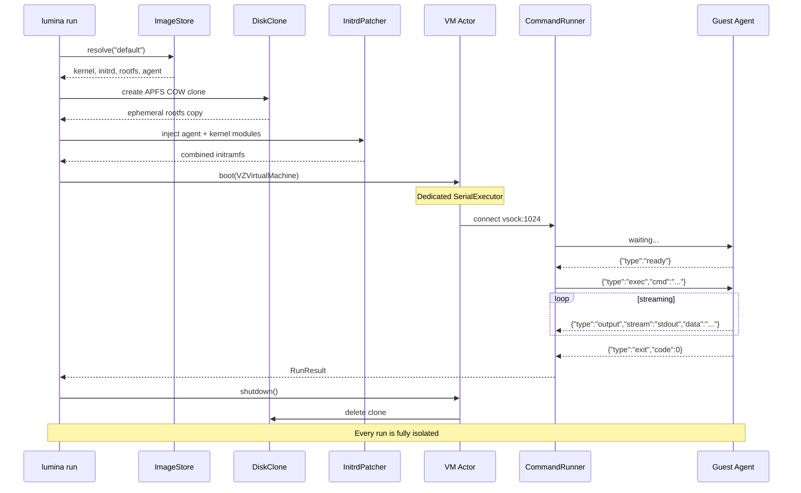
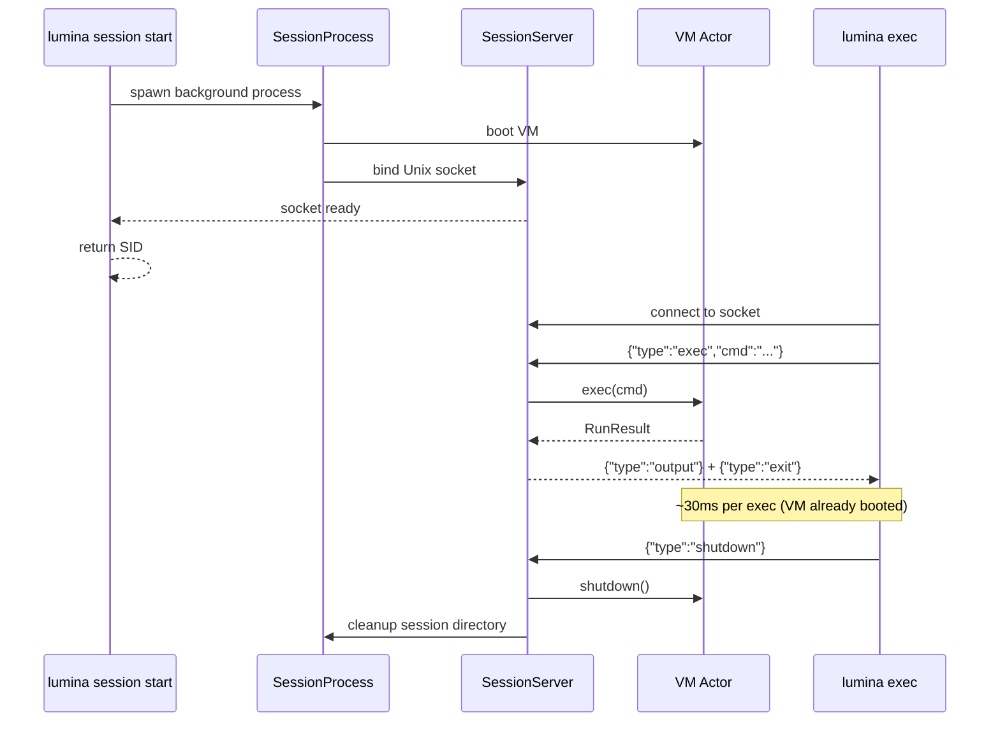
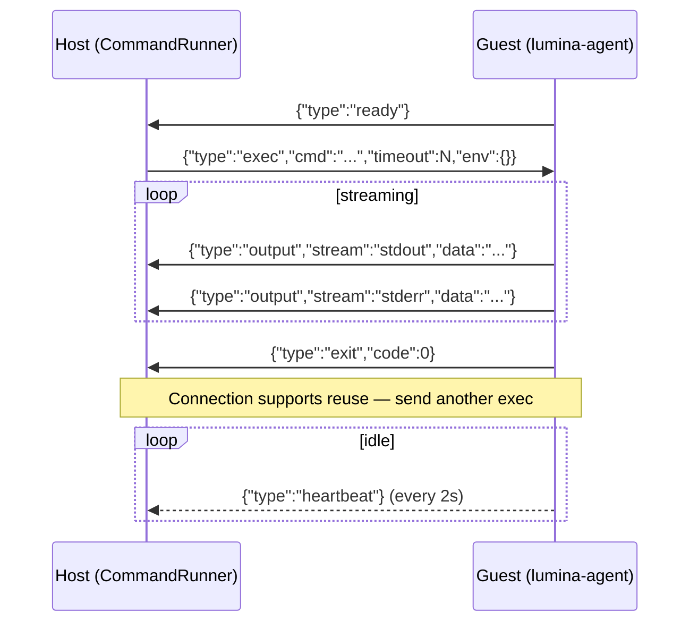

<div align="center">

# Lumina

**Native Apple Workload Runtime for Agents**

`subprocess.run()` for virtual machines.

[](https://github.com/abdul-abdi/lumina/actions/workflows/ci.yml)
[](https://swift.org)
[](https://developer.apple.com/macos/)
[](https://support.apple.com/en-us/116943)
[](LICENSE)

Boot a Linux VM, run a command, get the output.<br>
One function call. ~1.6s cold start. ~30ms warm exec. Zero host access.


</div>

---

## Get Started

> **Requires:** macOS 14+ (Sonoma) · Apple Silicon (M1/M2/M3/M4) · Go 1.21+ (guest agent only)

```bash
make install                        # build + install to ~/.local/bin
lumina run "echo hello world"       # image auto-pulls on first run
```

> If `~/.local/bin` isn't on your PATH, add it: `export PATH="$HOME/.local/bin:$PATH"`
>
> For a system-wide install: `sudo make install PREFIX=/usr/local`

## Why Lumina?

AI agents need to run untrusted code. The question is where.

| | Lumina | Docker | SSH to cloud VM |
|---|--------|--------|-----------------|
| **Cold start** | ~1.6s | ~3-5s | 30-60s |
| **Exec after boot** | ~30ms (CLI) · ~2ms (library) | ~50-100ms | ~20-50ms (RTT) |
| **Isolation** | Hardware (Virtualization.framework) | Kernel namespaces (shared kernel) | Full VM |
| **Host exposure** | None — no mounted filesystem, no Docker socket | Container escape risk, daemon access | Network-exposed |
| **Cleanup** | Automatic — COW clone deleted on exit | Manual — images/volumes linger | Manual — VM persists |
| **Dependencies** | Zero — ships as one binary | Docker daemon | Cloud account + SSH keys |
| **macOS native** | Yes — `VZVirtualMachine` | Linux-first (Docker Desktop is a VM) | N/A |
| **Agent-friendly output** | JSON by default when piped | Text only (needs parsing) | Text only |
| **Persistent sessions** | Built-in | N/A | SSH sessions |

For agents, boot time is paid once. Exec latency is paid every iteration. Lumina sessions give you both: hardware-isolated VMs with subprocess-fast execution. No daemon, no container registry, no cloud credentials.

## Features

| | Feature | Detail |
|---|---------|--------|
| ⚡ | **Instant VMs** | ~1.6s cold start, APFS copy-on-write clones |
| 🔒 | **Full isolation** | No host filesystem, credentials, or process access |
| 🔄 | **Persistent sessions** | Boot once, exec many — ~30ms per command (CLI), ~2ms (library) |
| 🐍 | **Custom images** | `images create python --run "apk add python3"` |
| 💾 | **Named volumes** | Persistent storage across VMs and sessions |
| 🌐 | **VM-to-VM networking** | Private ethernet switch for multi-VM setups |
| 📡 | **Live streaming** | `--stream` for real-time stdout/stderr |
| 📁 | **File transfers** | `--copy local:remote` / `--download remote:local` |
| 📂 | **Directory mounts** | `--mount host:guest` / `--volume name:guest` via virtio-fs |
| 🔑 | **Environment vars** | `-e KEY=VAL` (repeatable) |
| 🔄 | **Smart output** | Auto-JSON when piped, human text on TTY |
| 🧹 | **Self-cleaning** | Orphaned clones removed via signal handlers + `atexit` |

---

## Usage

### CLI

```bash
# Basics
lumina run "echo hello"
lumina run --stream "make build"
lumina run --timeout 2m --memory 1GB --cpus 4 "cargo test"

# Environment variables
lumina run -e API_KEY=sk-123 -e DEBUG=1 "env | grep API"

# File transfers
lumina run --copy ./data.csv:/tmp/data.csv \
           --download /tmp/results.json:./results.json \
           "python3 process.py"

# Mount a host directory
lumina run --mount ./src:/mnt/src "cat /mnt/src/README.md"

# Pipe-friendly — JSON output by default when not a TTY
lumina run "uname -a" | jq .stdout
```

### Sessions (Persistent VMs)

Boot once, exec many. The right abstraction for agents — pay the ~1.6s boot once, then run commands at ~30ms each.

```bash
# Start a persistent session (~1.6s boot)
SID=$(lumina session start | jq -r .sid)

# Execute commands — ~30ms each (VM already running)
lumina exec $SID "apk add python3"
lumina exec $SID "python3 -c 'print(42)'"
lumina exec $SID -e MY_VAR=hello "echo \$MY_VAR"

# File transfers work too
lumina exec $SID --copy ./script.py:/tmp/script.py "python3 /tmp/script.py"

# List active sessions
lumina session list

# Stop when done
lumina session stop $SID
```

Sessions with volumes — data persists across sessions and disposable runs:

```bash
lumina volume create workspace
SID=$(lumina session start --volume workspace:/data | jq -r .sid)
lumina exec $SID "echo 'cached result' > /data/output.txt"
lumina session stop $SID

# Data survives — read from a brand new VM
lumina run --volume workspace:/data "cat /data/output.txt"
```

### Custom Images

Pre-install packages so every run starts ready:

```bash
# Create a Python image (~17s to build, then ~1.6s to boot forever after)
lumina images create python --from default --run "apk add --no-cache python3"

# Use it — no install wait
lumina run --image python "python3 -c 'import sys; print(sys.version)'"

# Sessions with custom images
SID=$(lumina session start --image python | jq -r .sid)
lumina exec $SID "python3 script.py"   # instant, python pre-installed

# Manage images
lumina images list
lumina images inspect python
lumina images remove python
```

### Volumes

Named persistent storage, mounted via virtio-fs:

```bash
lumina volume create mydata
lumina run --volume mydata:/data "echo hello > /data/file.txt"
lumina run --volume mydata:/data "cat /data/file.txt"   # still there

lumina volume list
lumina volume inspect mydata
lumina volume remove mydata
```

### Networking (Multi-VM)

Run interconnected VMs on a shared private network:

```bash
# Create a manifest
cat > network.json << 'EOF'
{
  "sessions": [
    {"name": "db", "image": "default"},
    {"name": "api", "image": "default"}
  ]
}
EOF

# Boot all VMs on a shared ethernet switch
lumina network run --file network.json
# VMs can reach each other by name (db, api) via /etc/hosts
```

<details>
<summary><strong>Full CLI Reference</strong></summary>

```
USAGE: lumina <subcommand>

SUBCOMMANDS:
  run               Run a command in a disposable VM
  pull              Pull the default Alpine image from GitHub Releases
  images            Manage cached images (list, create, remove, inspect)
  clean             Remove orphaned COW clones and stale images
  session           Manage persistent VM sessions (start, stop, list)
  exec              Execute a command in a running session
  volume            Manage persistent volumes (create, list, remove, inspect)
  network           Run a group of VMs on a shared network
```

**`lumina run`**

```bash
lumina run <command>                          # run, print stdout
lumina run --image python <command>           # use a custom image
lumina run --stream <command>                 # stream output live
lumina run --timeout 30s <command>            # command timeout (default: 60s, excludes boot)
lumina run --memory 1GB --cpus 4 <command>    # resources (default: 512MB, 2 CPUs)
lumina run -e KEY=VAL <command>               # env vars (repeatable)
lumina run --copy local:remote <command>      # upload file before exec
lumina run --download remote:local <command>  # download file after exec
lumina run --mount host:guest <command>       # virtio-fs directory sharing
lumina run --volume name:guest <command>      # mount named volume
lumina run --text <command>                   # force human-readable output
LUMINA_FORMAT=json lumina run <command>       # force JSON output
```

**`lumina session`**

```bash
lumina session start                         # start with defaults
lumina session start --image python           # use custom image
lumina session start --memory 1GB --cpus 4    # configure resources
lumina session start --volume data:/mnt       # mount volume at boot
lumina session start --boot-timeout 2m        # boot timeout (default: 60s)
lumina session list                           # list active sessions
lumina session list --text                    # human-readable output
lumina session stop <sid>                     # stop and confirm
# → {"confirmed":true,"stopped":"<sid>"}
```

**`lumina exec`**

```bash
lumina exec <sid> <command>                   # execute in session
lumina exec <sid> <command> --stream          # stream output live
lumina exec <sid> <command> -e KEY=VAL        # env vars (repeatable)
lumina exec <sid> <command> --copy l:r        # upload before exec
lumina exec <sid> <command> --download r:l    # download after exec
lumina exec <sid> <command> --timeout 2m      # timeout (default: 60s)
lumina exec <sid> <command> --text            # human-readable output
```

**`lumina images`**

```bash
lumina images list                            # list cached images
lumina images create NAME --from BASE --run CMD  # build custom image
lumina images create NAME --run CMD --timeout 5m # with build timeout (default: 5m)
lumina images inspect NAME                    # show image details
lumina images remove NAME                     # remove (checks deps)
```

**`lumina volume`**

```bash
lumina volume create NAME                     # create named volume
lumina volume list                            # list all volumes
lumina volume inspect NAME                    # show details + size
lumina volume remove NAME                     # delete volume
```

**`lumina pull` / `lumina clean`**

```bash
lumina pull                                   # download default image
lumina pull --force                           # re-download even if exists
lumina clean                                  # remove orphaned COW clones
```

**Output format priority:** `LUMINA_FORMAT` env var > `--text` flag > auto-detect (JSON when piped, text on TTY).

</details>

### Swift Library

```swift
import Lumina

// One-shot — boot, exec, teardown in one call
let result = try await Lumina.run("cargo test", options: RunOptions(
    timeout: .seconds(120),
    memory: 1024 * 1024 * 1024,    // 1 GB
    cpuCount: 4,
    env: ["CI": "true"]
))
print(result.stdout)               // RunResult { stdout, stderr, exitCode, wallTime }

// Stream output in real time
for try await chunk in Lumina.stream("make build") {
    switch chunk {
    case .stdout(let text): print(text, terminator: "")
    case .stderr(let text): print(text, terminator: "", to: &stderr)
    case .exit(let code):   print("Exit: \(code)")
    }
}
```

<details>
<summary><strong>Advanced: Sessions, Custom Images, Volumes, Networking</strong></summary>

```swift
// File transfers — upload into VM, download results after execution
let result = try await Lumina.run("python3 /tmp/process.py", options: RunOptions(
    uploads: [FileUpload(localPath: inputURL, remotePath: "/tmp/process.py")],
    downloads: [FileDownload(remotePath: "/tmp/out.json", localPath: outputURL)]
))

// Lifecycle API — explicit control, multi-command sessions, connection reuse
let vm = VM(options: VMOptions(cpuCount: 4))
try await vm.boot()
try vm.uploadFiles([FileUpload(localPath: scriptURL, remotePath: "/tmp/run.sh")])
let r1 = try await vm.exec("chmod +x /tmp/run.sh && /tmp/run.sh")
let r2 = try await vm.exec("cat /tmp/results.json")  // reuses same connection
try vm.downloadFiles([FileDownload(remotePath: "/tmp/results.json", localPath: resultsURL)])
await vm.shutdown()

// Custom image creation — build once, boot fast forever
try await Lumina.createImage(name: "python", from: "default", command: "apk add python3")

// Private networking — VM-to-VM communication
try await Lumina.withNetwork("mynet") { network in
    let db  = try await network.session(name: "db",  image: "default")
    let api = try await network.session(name: "api", image: "default")
    // VMs share a private ethernet switch, can reach each other by name
    let result = try await api.exec("ping -c1 db")
    await network.shutdown()
}

// Custom networking — implement the NetworkProvider protocol
struct TapProvider: NetworkProvider {
    func createAttachment() throws -> VZNetworkDeviceAttachment { /* ... */ }
}
let vm = VM(options: VMOptions(networkProvider: TapProvider()))
```

</details>

---

## How It Works



<details>
<summary><strong>Session Architecture</strong></summary>



Sessions use Unix domain sockets at `~/.lumina/sessions/<sid>/control.sock` for IPC. The session server runs as a background process, accepts connections, and dispatches requests to the VM actor.

</details>

<details>
<summary><strong>Guest Agent Protocol</strong></summary>

Newline-delimited JSON over virtio-socket (port 1024, max 64KB per message):



**File transfers** use the same vsock connection with ACK-based backpressure:

| Direction | Flow |
|-----------|------|
| **Upload** (host → guest) | `upload` → `upload_ack` per 48KB chunk → `upload_done` |
| **Download** (guest → host) | `download_req` → `download_data` per 48KB chunk (seq + EOF) |

The host enforces deadlines. The guest receives a safety-net timeout at 3× the host value (minimum 30s) — loose enough to never race, tight enough to clean up if the host crashes.

</details>

<details>
<summary><strong>Architecture Deep Dive</strong></summary>

### Three-Layer API

```
                         ┌─────────────────────────────────┐
  Convenience API        │  Lumina.run() / Lumina.stream()  │
  (one-shot)             │  withVM { boot → exec → shut }  │
                         └──────────────┬──────────────────┘
                                        │
                         ┌──────────────▼──────────────────┐
  Session API            │  session start / exec / stop     │
  (persistent)           │  Unix socket IPC, ~30ms exec     │
                         └──────────────┬──────────────────┘
                                        │
                         ┌──────────────▼──────────────────┐
  Lifecycle API          │           VM actor               │
  (multi-command)        │  boot() → exec() → exec() → …   │
                         │  uploadFiles() / downloadFiles() │
                         │  shutdown()                      │
                         └─────────────────────────────────┘
```

### Internal Components

| Component | Role | Key Detail |
|-----------|------|------------|
| **VM** | Actor wrapping `VZVirtualMachine` | Custom `VMExecutor` (SerialExecutor) pins all VZ calls to a dedicated DispatchQueue |
| **CommandRunner** | vsock protocol + state machine | `ConnectionState` enum with explicit transitions, NSLock for thread safety |
| **InitrdPatcher** | Initramfs injection | Builds cpio newc archives, concatenates with base initrd. Composable network overlay. |
| **DiskClone** | Per-run ephemeral COW clones | PID file–based orphan detection; `cleanOrphans()` invoked via `atexit` + signal handlers |
| **ImageStore** | Image cache + custom creation | Staging-dir atomicity for crash-safe image builds. Symlinks shared assets from base. |
| **VolumeStore** | Named persistent volumes | Host directories at `~/.lumina/volumes/<name>/data/`, mounted via virtio-fs |
| **SessionServer** | Unix socket IPC server | Listens at `~/.lumina/sessions/<sid>/control.sock`, dispatches to VM actor |
| **SessionClient** | Unix socket IPC client | Validates session liveness, sends requests, receives streamed responses |
| **NetworkSwitch** | Ethernet frame relay | SOCK_DGRAM socketpairs, poll-based broadcast, dynamic port addition |
| **Network** | VM group manager | Actor coordinating multiple VMs on a shared virtual switch with IP assignment |
| **ImagePuller** | GitHub Releases downloader | SHA256 verification, auto-pull on first run from `abdul-abdi/lumina` releases |
| **NetworkProvider** | Pluggable network backend | Default: `NATNetworkProvider` (VZ NAT). Protocol for custom implementations. |
| **SerialConsole** | Serial output capture | Reads `hvc0` for crash diagnostics; surfaced in `LuminaError.guestCrashed` |

### Design Constraints

- **No shared mutable state** — each `Lumina.run()` creates its own VM, COW clone, and vsock connection
- **Zero external Swift dependencies** — library target links only `Virtualization.framework`
- **All public types are `Sendable`** — safe to use across concurrency domains
- **Guest agent uses raw `AF_VSOCK` syscalls** — Go's `net` package doesn't support vsock
- **Static IP networking** — NAT via `VZNATNetworkDeviceAttachment`, IP derived from MAC, DNS via gateway. DHCP fallback for edge cases.
- **Session IPC** — NDJSON over Unix domain sockets, one client at a time per session
- **Network relay** — reads ports under lock each iteration for dynamic VM join

</details>

---

## Building from Source

```bash
make build               # debug build + codesign (entitlements required)
make test                # unit tests (swift test)
make test-integration    # e2e tests (requires VM image + jq)
make release             # optimized build + codesign
make install             # release build → ~/.local/bin/lumina
make run ARGS="echo hi"  # build, sign, and run in one step
make clean               # remove .build/
```

<details>
<summary><strong>Building Components Separately</strong></summary>

```bash
# Build guest agent (cross-compile Go → linux/arm64)
cd Guest/lumina-agent && CGO_ENABLED=0 GOOS=linux GOARCH=arm64 go build -ldflags="-s -w" -o lumina-agent .

# Build VM image (requires e2fsprogs: brew install e2fsprogs)
cd Guest && bash build-image.sh
```

</details>
