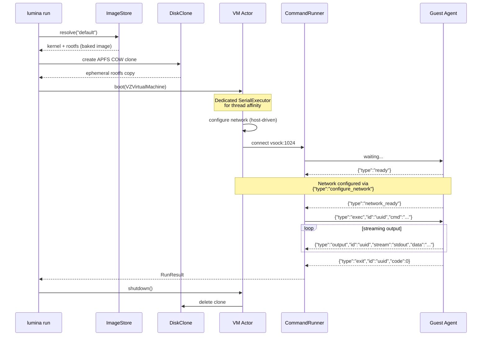
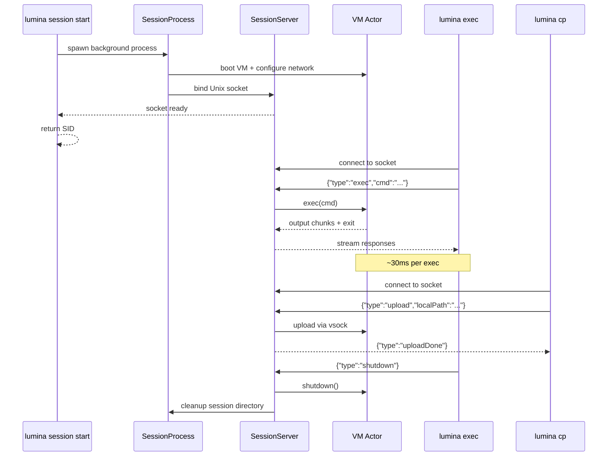
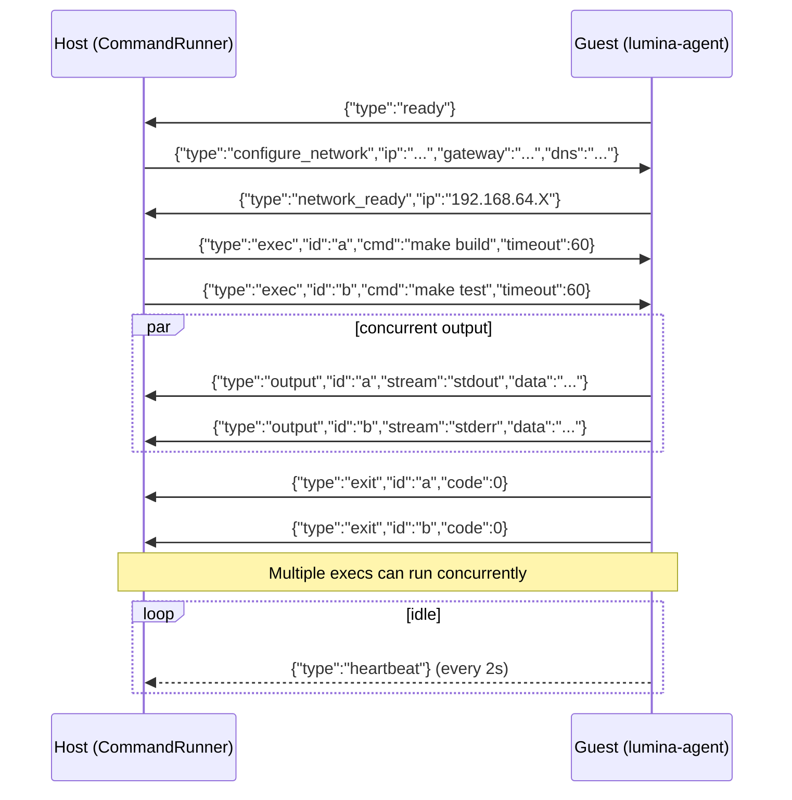

<div align="center">

# Lumina

**Native Apple Workload Runtime for Agents**

`subprocess.run()` for virtual machines.

[](https://github.com/abdul-abdi/lumina/actions/workflows/ci.yml)
[](https://swift.org)
[](https://developer.apple.com/macos/)
[](https://support.apple.com/en-us/116943)
[](LICENSE)

Boot a Linux VM, run a command, get the output.<br>
One function call. ~1.6s cold start (~300ms with custom kernel). ~30ms warm exec. Zero host access.


</div>

---

## Get Started

> **Requires:** macOS 14+ (Sonoma) &middot; Apple Silicon (M1/M2/M3/M4)

```bash
make install                        # build + install to ~/.local/bin
lumina run "echo hello world"       # image auto-pulls on first run
```

> If `~/.local/bin` isn't on your PATH: `export PATH="$HOME/.local/bin:$PATH"`
>
> For a system-wide install: `sudo make install PREFIX=/usr/local`

## Why Lumina?

AI agents need to run untrusted code. The question is where.

| | Lumina | Docker | SSH to cloud VM |
|---|--------|--------|-----------------|
| **Cold start** | ~300ms | ~3-5s | 30-60s |
| **Exec after boot** | ~30ms (CLI) &middot; ~2ms (library) | ~50-100ms | ~20-50ms (RTT) |
| **Isolation** | Hardware (Virtualization.framework) | Kernel namespaces (shared kernel) | Full VM |
| **Host exposure** | None — no mounted filesystem, no Docker socket | Container escape risk, daemon access | Network-exposed |
| **Cleanup** | Automatic — COW clone deleted on exit | Manual — images/volumes linger | Manual — VM persists |
| **Dependencies** | Zero — ships as one binary | Docker daemon | Cloud account + SSH keys |
| **macOS native** | Yes — `VZVirtualMachine` | Linux-first (Docker Desktop is a VM) | N/A |
| **Agent-friendly** | JSON when piped, text on TTY — zero config | Text only (needs parsing) | Text only |
| **Persistent sessions** | Built-in | N/A | SSH sessions |

Boot time is paid once. Exec latency is paid every iteration. Lumina sessions give you both: hardware-isolated VMs with subprocess-fast execution. No daemon, no container registry, no cloud credentials.

## Usage

### One-shot (Disposable VMs)

```bash
# Run a command — streams output on terminal, returns JSON when piped
lumina run "echo hello"
lumina run "make build"

# Environment variables
lumina run -e API_KEY=sk-123 -e DEBUG=1 "env | grep API"

# File transfers — auto-detects file vs directory
lumina run --copy ./data.csv:/tmp/data.csv "python3 process.py"
lumina run --copy ./project:/code --workdir /code "make build"
lumina run --download /tmp/results.json:./results.json "generate-report"

# Named volumes — data persists across runs
lumina run --volume mydata:/data "echo hello > /data/file.txt"
lumina run --volume mydata:/data "cat /data/file.txt"   # still there

# Host directory mount
lumina run --volume ./src:/mnt/src "cat /mnt/src/README.md"

# Pipe-friendly — JSON output by default when not a TTY
lumina run "uname -a" | jq .stdout
```

`lumina run` has 7 flags. Everything else (memory, CPUs, streaming, output format) is auto-detected or configurable via environment variables. See [Environment Variables](#environment-variables).

### Sessions (Persistent VMs)

Boot once, exec many. Pay ~300ms boot once, then run commands at ~30ms each.

```bash
# Start a session — configure resources at creation time
SID=$(LUMINA_FORMAT=text lumina session start)
SID=$(LUMINA_FORMAT=text lumina session start --memory 4GB --cpus 4 --disk-size 8GB)

# Execute commands — ~30ms each (VM already running)
lumina exec $SID "apk add python3"
lumina exec $SID "python3 -c 'print(42)'"
lumina exec $SID -e MY_VAR=hello "echo \$MY_VAR"
lumina exec $SID --workdir /tmp "pwd"

# File transfers via lumina cp
lumina cp ./script.py $SID:/tmp/script.py
lumina exec $SID "python3 /tmp/script.py"
lumina cp $SID:/tmp/output.txt ./output.txt

# List and stop
lumina session list
lumina session stop $SID
```

Sessions with volumes — data persists across sessions and disposable runs:

```bash
lumina volume create workspace
SID=$(LUMINA_FORMAT=text lumina session start --volume workspace:/data)
lumina exec $SID "echo 'cached result' > /data/output.txt"
lumina session stop $SID

# Data survives — read from a brand new VM
lumina run --volume workspace:/data "cat /data/output.txt"
```

### Custom Images

Pre-install packages so every run starts ready:

```bash
# Create a Python image (~17s to build, then ~300ms to boot forever after)
lumina images create python --from default --run "apk add --no-cache python3"

# Multi-step builds — abort on first failure
lumina images create godev --from default --run "apk add go" --run "apk add git"

# Rosetta for x86_64 binaries — stored in image metadata, auto-detected at boot
lumina images create x86dev --from default --run "apt install gcc" --rosetta

# Use custom images — no install wait
lumina run --image python "python3 -c 'import sys; print(sys.version)'"

# Manage images
lumina images list
lumina images inspect python
lumina images remove python
```

### Volumes

Named persistent storage, mounted via virtio-fs:

```bash
lumina volume create mydata
lumina run --volume mydata:/data "echo hello > /data/file.txt"
lumina run --volume mydata:/data "cat /data/file.txt"   # still there

lumina volume list
lumina volume inspect mydata
lumina volume remove mydata
```

### Networking (Multi-VM)

Run interconnected VMs on a shared private network:

```bash
cat > network.json << 'EOF'
{
  "sessions": [
    {"name": "db", "image": "default"},
    {"name": "api", "image": "default"}
  ]
}
EOF

# Boot all VMs on a shared ethernet switch
lumina network run network.json
# VMs can reach each other by name (db, api) via /etc/hosts
```

---

## Environment Variables

Resource configuration, output format, and streaming are controlled via environment variables. Set once, forget forever.

| Variable | Controls | Default | Example |
|----------|----------|---------|---------|
| `LUMINA_MEMORY` | VM memory | `1GB` | `LUMINA_MEMORY=2GB` |
| `LUMINA_CPUS` | CPU cores | `2` | `LUMINA_CPUS=4` |
| `LUMINA_TIMEOUT` | Command timeout | `60s` | `LUMINA_TIMEOUT=300s` |
| `LUMINA_DISK_SIZE` | Rootfs size | image default | `LUMINA_DISK_SIZE=4GB` |
| `LUMINA_FORMAT` | Output format | auto (JSON piped, text TTY) | `LUMINA_FORMAT=text` |
| `LUMINA_STREAM` | Streaming mode | auto (stream TTY, buffer piped) | `LUMINA_STREAM=1` |

**Priority:** `session start` flags > env var > built-in default.

For `lumina run`, resource settings come from env vars only (no flags). This keeps the common case clean — agents set env vars once in their environment, every `run` command inherits them.

For `lumina session start`, resource flags (`--memory`, `--cpus`, `--disk-size`) override env vars. This lets you provision different sessions with different resources in the same workflow.

---

## Auto-Detection

Lumina auto-detects everything it can so you type less:

| Feature | How it works |
|---------|-------------|
| **Output format** | JSON when piped (for agents), text on TTY (for humans) |
| **Streaming** | Streams on TTY (real-time output), buffers when piped (complete JSON result) |
| **`--copy` file/dir** | Stats the local path — routes to file upload or directory tar+upload |
| **`--download` file/dir** | Execs `test -d` on the guest — routes to file download or directory tar+download |
| **`--volume` mount/volume** | Path prefix (`/` or `.`) = host directory mount, otherwise = named volume lookup |
| **Rosetta** | Read from image metadata at boot. Set via `images create --rosetta`. |
| **Network** | Always configured. No flags needed. |
| **Image pull** | Auto-pulls default image on first run if not present. |

---

<details>
<summary><strong>Full CLI Reference</strong></summary>

### `lumina run` (7 flags)

```bash
lumina run <command>                          # run, stream on TTY, JSON when piped
lumina run --image python <command>           # use a custom image
lumina run --timeout 5m <command>             # command timeout (default: 60s)
lumina run -e KEY=VAL <command>               # env vars (repeatable)
lumina run --copy local:remote <command>      # upload file or directory before exec
lumina run --download remote:local <command>  # download file or directory after exec
lumina run --volume path_or_name:guest <cmd>  # mount host dir or named volume
lumina run --workdir /code <command>          # working directory inside VM
```

### `lumina exec` (3 flags)

```bash
lumina exec <sid> <command>                   # always streams
lumina exec <sid> --timeout 5m <command>      # timeout
lumina exec <sid> -e KEY=VAL <command>        # env vars (repeatable)
lumina exec <sid> --workdir /code <command>   # working directory
```

### `lumina cp` (0 flags)

```bash
lumina cp ./local.txt <sid>:/remote.txt       # upload to session
lumina cp <sid>:/remote.txt ./local.txt       # download from session
```

### `lumina session` (5 flags on start)

```bash
lumina session start                          # start with defaults
lumina session start --image python           # custom image
lumina session start --memory 4GB --cpus 4    # configure resources
lumina session start --disk-size 8GB          # larger rootfs
lumina session start --volume data:/mnt       # mount volume at boot
lumina session list                           # list active sessions
lumina session stop <sid>                     # stop session
```

### `lumina images` (4 flags on create)

```bash
lumina images list                            # list cached images
lumina images create NAME --from BASE --run CMD  # build custom image
lumina images create NAME --run CMD --run CMD2   # multi-step build
lumina images create NAME --run CMD --rosetta    # x86_64 image
lumina images create NAME --timeout 10m --run CMD  # build timeout
lumina images inspect NAME                    # show image details
lumina images remove NAME                     # remove (checks deps)
```

### `lumina volume`

```bash
lumina volume create NAME                     # create named volume
lumina volume list                            # list all volumes
lumina volume inspect NAME                    # show details + size
lumina volume remove NAME                     # delete volume
```

### `lumina pull` / `lumina clean` / `lumina network`

```bash
lumina pull                                   # download default image
lumina pull --force                           # re-download even if exists
lumina clean                                  # remove orphaned COW clones
lumina network run manifest.json              # boot VMs from manifest
```

**20 flags total across 17 commands.**

</details>

---

### Swift Library

```swift
import Lumina

// One-shot — boot, exec, teardown in one call
let result = try await Lumina.run("cargo test", options: RunOptions(
    timeout: .seconds(120),
    image: "default",
    env: ["CI": "true"]
))
print(result.stdout)               // RunResult { stdout, stderr, exitCode, wallTime }

// Stream output in real time
for try await chunk in Lumina.stream("make build") {
    switch chunk {
    case .stdout(let text): print(text, terminator: "")
    case .stderr(let text): print(text, terminator: "", to: &stderr)
    case .exit(let code):   print("Exit: \(code)")
    }
}
```

<details>
<summary><strong>Advanced: Sessions, Custom Images, Volumes, Networking</strong></summary>

```swift
// File transfers — upload into VM, download results after execution
let result = try await Lumina.run("python3 /tmp/process.py", options: RunOptions(
    uploads: [FileUpload(localPath: inputURL, remotePath: "/tmp/process.py")],
    downloads: [FileDownload(remotePath: "/tmp/out.json", localPath: outputURL)]
))

// Custom image creation — build once, boot fast forever
try await Lumina.createImage(
    name: "python", from: "default", command: "apk add python3"
)

// Rosetta images for x86_64 binaries
try await Lumina.createImage(
    name: "x86dev", from: "default", command: "apt install gcc", rosetta: true
)

// Lifecycle API — explicit control, multi-command sessions
let vm = VM(options: VMOptions(cpuCount: 4))
try await vm.boot()
try await vm.uploadFiles([FileUpload(localPath: scriptURL, remotePath: "/tmp/run.sh")])
let r1 = try await vm.exec("chmod +x /tmp/run.sh && /tmp/run.sh")
let r2 = try await vm.exec("cat /tmp/results.json")
await vm.shutdown()

// Private networking — VM-to-VM communication
try await Lumina.withNetwork("mynet") { network in
    let db  = try await network.session(name: "db",  image: "default")
    let api = try await network.session(name: "api", image: "default")
    let result = try await api.exec("ping -c1 db")
}
```

</details>

---

## How It Works



<details>
<summary><strong>Session Architecture</strong></summary>



Sessions use Unix domain sockets at `~/.lumina/sessions/<sid>/control.sock` for IPC. The session server runs as a background process, accepts connections, and dispatches to the VM actor. File transfers go through `lumina cp` — a separate command with scp-style syntax.

</details>

<details>
<summary><strong>Guest Agent Protocol</strong></summary>

Newline-delimited JSON over virtio-socket (port 1024, max 128KB per message). All exec messages carry an `id` field for concurrent command multiplexing.



**File transfers** use the same vsock connection with ACK-based backpressure:

| Direction | Flow |
|-----------|------|
| **Upload** (host -> guest) | `upload` -> `upload_ack` per 48KB chunk -> `upload_done` |
| **Download** (guest -> host) | `download_req` -> `download_data` per 48KB chunk (seq + EOF) |

**Stdin piping:**

| Message | Direction | Purpose |
|---------|-----------|---------|
| `{"type":"stdin","id":"uuid","data":"..."}` | host -> guest | Pipe data to running command |
| `{"type":"stdin_close","id":"uuid"}` | host -> guest | Close stdin pipe (triggers EOF) |

**Cancellation:**

| Message | Direction | Purpose |
|---------|-----------|---------|
| `{"type":"cancel","id":"uuid","signal":15,"grace_period":5}` | host -> guest | Signal a specific command |
| `{"type":"cancel","signal":9}` | host -> guest | Kill all running commands |

</details>

<details>
<summary><strong>Architecture Deep Dive</strong></summary>

### Three-Layer API

```
                         +-----------------------------------+
  Convenience API        |  Lumina.run() / Lumina.stream()   |
  (one-shot)             |  withVM { boot -> exec -> shut }  |
                         +----------------+------------------+
                                          |
                         +----------------v------------------+
  Session API            |  session start / exec / cp / stop |
  (persistent)           |  Unix socket IPC, ~30ms exec      |
                         +----------------+------------------+
                                          |
                         +----------------v------------------+
  Lifecycle API          |           VM actor                |
  (multi-command)        |  boot() -> exec() -> exec() -> .. |
                         |  uploadFiles() / downloadFiles()  |
                         |  shutdown()                       |
                         +-----------------------------------+
```

### Internal Components

| Component | Role | Key Detail |
|-----------|------|------------|
| **VM** | Actor wrapping `VZVirtualMachine` | Custom `VMExecutor` (SerialExecutor) pins all VZ calls to a dedicated DispatchQueue |
| **CommandRunner** | vsock protocol + dispatcher | Per-exec `AsyncStream` handlers keyed by ID for concurrent multiplexing |
| **DiskClone** | Per-run ephemeral COW clones | PID file-based orphan detection; `cleanOrphans()` via `atexit` + signal handlers |
| **ImageStore** | Image cache + custom creation | Staging-dir atomicity for crash-safe builds. Rosetta stored in `ImageMeta`. |
| **VolumeStore** | Named persistent volumes | Host directories at `~/.lumina/volumes/<name>/data/`, mounted via virtio-fs |
| **SessionServer** | Unix socket IPC server | Listens at `~/.lumina/sessions/<sid>/control.sock`, dispatches to VM actor |
| **SessionClient** | Unix socket IPC client | Validates session liveness, sends requests, receives streamed responses |
| **NetworkSwitch** | Ethernet frame relay | SOCK_DGRAM socketpairs, poll-based broadcast, dynamic port addition |
| **Network** | VM group manager | Actor coordinating multiple VMs on a shared virtual switch with IP assignment |
| **SerialConsole** | Serial output capture | Reads `hvc0` for crash diagnostics; surfaced in `LuminaError.guestCrashed` |

### Image Formats

| | Baked (default) | Legacy (backward-compat) |
|---|---|---|
| **Contents** | `vmlinuz` + `rootfs.img` | `vmlinuz` + `initrd` + `rootfs.img` + `lumina-agent` + `modules/` |
| **Boot path** | kernel -> mount root -> `/sbin/init` -> agent | kernel -> initrd -> load modules -> switch_root -> agent |
| **Network config** | Kernel cmdline params | Initrd overlay |
| **Boot time** | ~200-300ms | ~570ms |

Detection is automatic via `ImagePaths.bootContract` (`.baked` when initrd is absent, else `.legacyWithInitrd`).

### Design Constraints

- **No shared mutable state** — each `Lumina.run()` creates its own VM, COW clone, and vsock connection
- **Zero external Swift dependencies** — library links only `Virtualization.framework` (CLI adds `swift-argument-parser`)
- **All public types are `Sendable`** — safe to use across concurrency domains
- **Concurrent exec** — multiple commands run on the same VM via ID-keyed dispatcher
- **Configuration vs invocation** — image-level settings (rosetta) in metadata, environment-level (memory/cpus) in env vars, per-invocation (timeout/env/workdir) as CLI flags
- **Network always on** — host-driven config, IP derived from MAC, no flags needed

</details>

---

## Building from Source

```bash
make build               # debug build + codesign (entitlements required)
make test                # unit + integration tests (146 tests)
make test-integration    # e2e tests (requires VM image + jq)
make release             # optimized build + codesign
make install             # release build -> ~/.local/bin/lumina
make run ARGS="echo hi"  # build, sign, and run in one step
make clean               # remove .build/
```

<details>
<summary><strong>Building Components Separately</strong></summary>

```bash
# Build guest agent (cross-compile Go -> linux/arm64)
cd Guest/lumina-agent
CGO_ENABLED=0 GOOS=linux GOARCH=arm64 go build -ldflags="-s -w" -o lumina-agent .

# Build VM image (requires e2fsprogs: brew install e2fsprogs)
cd Guest && bash build-image.sh

# Build custom kernel (Linux arm64 only — runs on CI)
bash Guest/build-kernel.sh /tmp/lumina-kernel/vmlinuz

# Build baked image with custom kernel
LUMINA_KERNEL=/tmp/lumina-kernel/vmlinuz bash Guest/build-image.sh
```

</details>

## Requirements

- macOS 14+ (Sonoma)
- Apple Silicon (M1, M2, M3, M4)
- Go 1.21+ (guest agent build only — not needed for CLI usage)

## License

[MIT](LICENSE) &copy; 2026 Abdullahi Abdi
