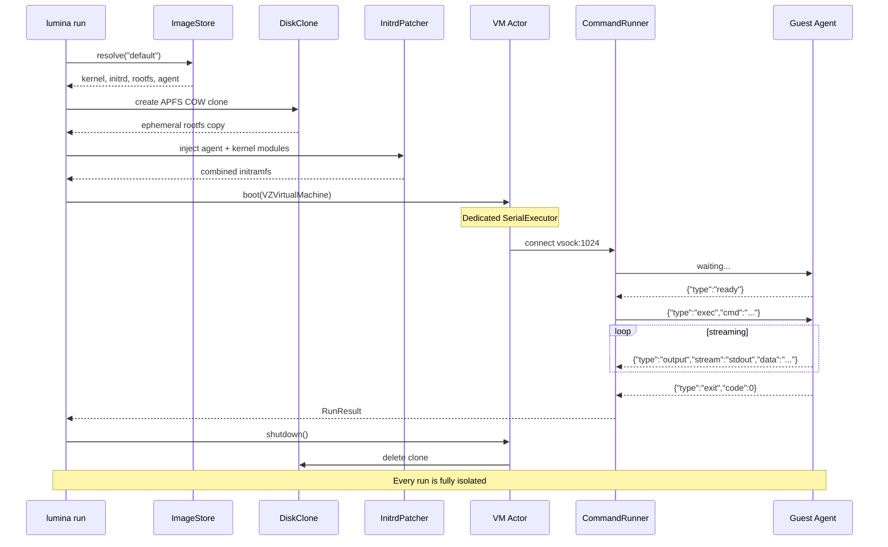

<div align="center">

# Lumina

**Native Apple Workload Runtime for Agents**

`subprocess.run()` for virtual machines.

[](https://github.com/abdul-abdi/lumina/actions/workflows/ci.yml)
[](https://swift.org)
[](https://developer.apple.com/macos/)
[](https://support.apple.com/en-us/116943)
[](LICENSE)

Boot a disposable Linux VM, run a command, get the output.<br>
One function call. ~2s cold start. Zero host access.


</div>

---

## Get Started

> **Requires:** macOS 14+ (Sonoma) · Apple Silicon (M1/M2/M3/M4) · Go 1.21+ (guest agent only)

```bash
make install                        # build + install to ~/.local/bin
lumina run "echo hello world"       # image auto-pulls on first run
```

> If `~/.local/bin` isn't on your PATH, add it: `export PATH="$HOME/.local/bin:$PATH"`
>
> For a system-wide install: `sudo make install PREFIX=/usr/local`

## Why Lumina?

AI agents need to run untrusted code. The question is where.

| | Lumina | Docker | SSH to cloud VM |
|---|--------|--------|-----------------|
| **Boot time** | ~2s | ~3-5s | 30-60s |
| **Isolation** | Hardware (Virtualization.framework) | Kernel namespaces (shared kernel) | Full VM |
| **Host exposure** | None — no mounted filesystem, no Docker socket | Container escape risk, daemon access | Network-exposed |
| **Cleanup** | Automatic — COW clone deleted on exit | Manual — images/volumes linger | Manual — VM persists |
| **Dependencies** | Zero — ships as one binary | Docker daemon | Cloud account + SSH keys |
| **macOS native** | Yes — `VZVirtualMachine` | Linux-first (Docker Desktop is a VM) | N/A |
| **Agent-friendly output** | JSON by default when piped | Text only (needs parsing) | Text only |

Lumina is purpose-built for the pattern: *boot, run, destroy*. No daemon, no container registry, no cloud credentials. Just a function call.

## Features

| | Feature | Detail |
|---|---------|--------|
| ⚡ | **Instant VMs** | ~2s cold start, APFS copy-on-write clones |
| 🔒 | **Full isolation** | No host filesystem, credentials, or process access |
| 📡 | **Live streaming** | `--stream` for real-time stdout/stderr |
| 📁 | **File transfers** | `--copy local:remote` / `--download remote:local` |
| 📂 | **Directory mounts** | `--mount host:guest` via virtio-fs |
| 🔑 | **Environment vars** | `-e KEY=VAL` (repeatable) |
| 🔄 | **Smart output** | Auto-JSON when piped, human text on TTY |
| 🧹 | **Self-cleaning** | Orphaned clones removed via signal handlers + `atexit` |

---

## Usage

### CLI

```bash
# Basics
lumina run "echo hello"
lumina run --stream "make build"
lumina run --timeout 2m --memory 1GB --cpus 4 "cargo test"

# Environment variables
lumina run -e API_KEY=sk-123 -e DEBUG=1 "env | grep API"

# File transfers
lumina run --copy ./data.csv:/tmp/data.csv \
           --download /tmp/results.json:./results.json \
           "python3 process.py"

# Mount a host directory
lumina run --mount ./src:/mnt/src "cat /mnt/src/README.md"

# Pipe-friendly — JSON output by default when not a TTY
lumina run "uname -a" | jq .stdout
```

<details>
<summary><strong>Full CLI Reference</strong></summary>

```
USAGE: lumina <subcommand>

SUBCOMMANDS:
  run               Run a command in a disposable VM
  pull              Pull the default Alpine image from GitHub Releases
  images            List cached images
  clean             Remove orphaned COW clones and stale images
```

**`lumina run`**

```bash
lumina run <command>                          # run, print stdout
lumina run --stream <command>                 # stream output live
lumina run --timeout 30s <command>            # timeout (default: 60s)
lumina run --memory 1GB --cpus 4 <command>    # resources (default: 512MB, 2 CPUs)
lumina run -e KEY=VAL <command>               # env vars (repeatable)
lumina run --copy local:remote <command>      # upload file before exec
lumina run --download remote:local <command>  # download file after exec
lumina run --mount host:guest <command>       # virtio-fs directory sharing
lumina run --text <command>                   # force human-readable output
LUMINA_FORMAT=json lumina run <command>       # force JSON output
```

**`lumina pull`**

```bash
lumina pull                                   # download default image
lumina pull --force                           # re-download even if exists
```

**`lumina images` / `lumina clean`**

```bash
lumina images                                 # list cached images
lumina clean                                  # remove orphaned COW clones
```

**Output format priority:** `LUMINA_FORMAT` env var > `--text` flag > auto-detect (JSON when piped, text on TTY).

</details>

### Swift Library

```swift
import Lumina

// One-shot — boot, exec, teardown in one call
let result = try await Lumina.run("cargo test", options: RunOptions(
    timeout: .seconds(120),
    memory: 1024 * 1024 * 1024,    // 1 GB
    cpuCount: 4,
    env: ["CI": "true"]
))
print(result.stdout)               // RunResult { stdout, stderr, exitCode, wallTime }

// Stream output in real time
for try await chunk in Lumina.stream("make build") {
    switch chunk {
    case .stdout(let text): print(text, terminator: "")
    case .stderr(let text): print(text, terminator: "", to: &stderr)
    case .exit(let code):   print("Exit: \(code)")
    }
}
```

<details>
<summary><strong>Advanced: File Transfers, Lifecycle API, NetworkProvider</strong></summary>

```swift
// Upload files into the VM, download results after execution
let result = try await Lumina.run("python3 /tmp/process.py", options: RunOptions(
    uploads: [FileUpload(localPath: inputURL, remotePath: "/tmp/process.py")],
    downloads: [FileDownload(remotePath: "/tmp/out.json", localPath: outputURL)]
))

// Lifecycle API — explicit control, multi-command sessions, connection reuse
let vm = VM(options: VMOptions(cpuCount: 4))
try await vm.boot()
try vm.uploadFiles([FileUpload(localPath: scriptURL, remotePath: "/tmp/run.sh")])
let r1 = try await vm.exec("chmod +x /tmp/run.sh && /tmp/run.sh")
let r2 = try await vm.exec("cat /tmp/results.json")  // reuses same connection
try vm.downloadFiles([FileDownload(remotePath: "/tmp/results.json", localPath: resultsURL)])
await vm.shutdown()

// Custom networking — implement the NetworkProvider protocol
struct TapProvider: NetworkProvider {
    func createAttachment() throws -> VZNetworkDeviceAttachment { /* ... */ }
}
let vm = VM(options: VMOptions(networkProvider: TapProvider()))
```

</details>

---

## How It Works



<details>
<summary><strong>Guest Agent Protocol</strong></summary>

Newline-delimited JSON over virtio-socket (port 1024, max 64KB per message):


**File transfers** use the same vsock connection with ACK-based backpressure:

| Direction | Flow |
|-----------|------|
| **Upload** (host → guest) | `upload` → `upload_ack` per 48KB chunk → `upload_done` |
| **Download** (guest → host) | `download_req` → `download_data` per 48KB chunk (seq + EOF) |

The host enforces deadlines. The guest receives a safety-net timeout at 3× the host value (minimum 30s) — loose enough to never race, tight enough to clean up if the host crashes.

</details>

<details>
<summary><strong>Architecture Deep Dive</strong></summary>

### Two-Layer API

```
                         ┌─────────────────────────────────┐
  Convenience API        │  Lumina.run() / Lumina.stream()  │
  (one-shot)             │  withVM { boot → exec → shut }  │
                         └──────────────┬──────────────────┘
                                        │
                         ┌──────────────▼──────────────────┐
  Lifecycle API          │           VM actor               │
  (multi-command)        │  boot() → exec() → exec() → …   │
                         │  uploadFiles() / downloadFiles() │
                         │  shutdown()                      │
                         └─────────────────────────────────┘
```

### Internal Components

| Component | Role | Key Detail |
|-----------|------|------------|
| **VM** | Actor wrapping `VZVirtualMachine` | Custom `VMExecutor` (SerialExecutor) pins all VZ calls to a dedicated DispatchQueue |
| **CommandRunner** | vsock protocol + state machine | `ConnectionState` enum with explicit transitions, NSLock for thread safety |
| **InitrdPatcher** | Initramfs injection | Builds cpio newc archives, concatenates with base initrd — Linux extracts both |
| **DiskClone** | Per-run ephemeral COW clones | PID file–based orphan detection; `cleanOrphans()` invoked by CLI via `atexit` + signal handlers |
| **ImageStore** | Long-lived image cache | Resolves kernel + initrd + rootfs + optional agent + optional kernel modules |
| **ImagePuller** | GitHub Releases downloader | SHA256 verification, auto-pull on first run from `abdul-abdi/lumina` releases |
| **NetworkProvider** | Pluggable network backend | Default: `NATNetworkProvider` (VZ NAT). Protocol for custom implementations. |
| **SerialConsole** | Serial output capture | Reads `hvc0` for crash diagnostics; surfaced in `LuminaError.guestCrashed` |

### Design Constraints

- **No shared mutable state** — each `Lumina.run()` creates its own VM, COW clone, and vsock connection
- **Zero external Swift dependencies** — library target links only `Virtualization.framework`
- **All public types are `Sendable`** — safe to use across concurrency domains
- **Guest agent uses raw `AF_VSOCK` syscalls** — Go's `net` package doesn't support vsock
- **DHCP networking** — NAT provided by `VZNATNetworkDeviceAttachment`, DNS via gateway

</details>

---

## Building from Source

```bash
make build               # debug build + codesign (entitlements required)
make test                # unit tests (swift test)
make test-integration    # e2e tests (requires VM image + jq)
make release             # optimized build + codesign
make install             # release build → ~/.local/bin/lumina
make run ARGS="echo hi"  # build, sign, and run in one step
make clean               # remove .build/
```

<details>
<summary><strong>Building Components Separately</strong></summary>

```bash
# Build guest agent (cross-compile Go → linux/arm64)
cd Guest/lumina-agent && CGO_ENABLED=0 GOOS=linux GOARCH=arm64 go build -ldflags="-s -w" -o lumina-agent .

# Build VM image (requires e2fsprogs: brew install e2fsprogs)
cd Guest && bash build-image.sh
```

</details>
